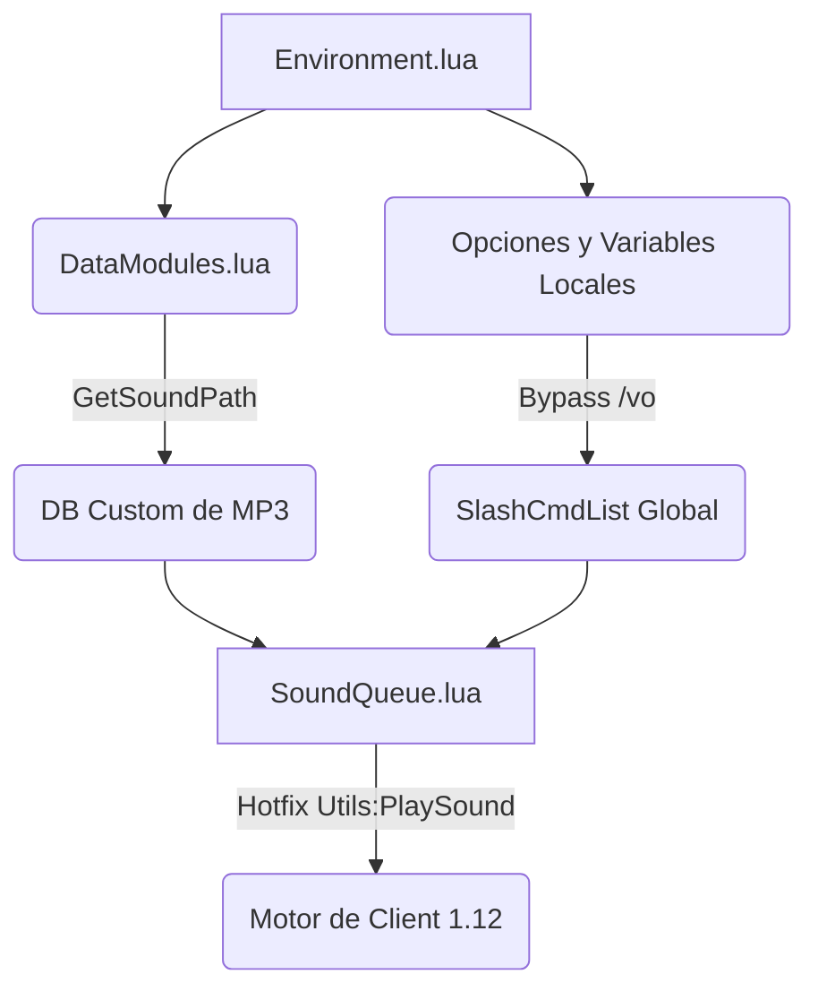

# Arquitectura de QuestVoice (Diamond-Tier)

La estructura "Core" del VoiceOver se compone de subsistemas completamente desacoplados. Su objetivo principal es sobrepasar el aislamiento obsoleto del cliente *Vanilla* (1.12.1), resolviendo interferencias producidas por la inyección de `Ace3` u otros superposicionales lógicos compartidos globalmente (e.g. *pfQuest*).

## Diagrama Modular

## Aislamiento Crítico (The Ace3 Enigma)
Para evitar colapsos por llamadas perdidas a `RegisterOptionsTable`, **QuestVoice** opta por no cargar paneles enteros anidados de `AceGUIFrame`. 
Utilizando `CreateFrame("Frame", ...)`, QuestVoice dibuja formal y nativamente todos sus `Checkbuttons` y opciones de la base de datos `AceDB`. Esto purga la dependencia en la inestable librería gráfica porteada de Vanilla y erradica el fatal error de punteros `nil`.

## Estructura Monorepo y Bilingüismo
Para garantizar una distribución atómica, el motor utiliza un **Sistema de Sub-módulos Internos**. El pack de voces en español (`data/AI_VoiceOverData_Vanilla_esES/`) se registra como un objeto aislado con una **prioridad Diamond-Tier (500)**. 

Esto permite que:
1. El motor consulte primero el diccionario localizado (ES).
2. Si el audio no existe, realice un *fallback* automático al diccionario base (EN) de `data/generated/`.
3. Todos los activos se carguen desde un único archivo `.toc`, eliminando la necesidad de múltiples Addons en la lista del juego.

---

## Cola y Sincronismo (The FMOD Problem)

El cliente original de WOW sufre si el CVar "EnableSound" se apaga y enciende repetidamente dentro del mismo frame porque reinicia forzosamente el canal maestro. **QuestVoice interrumpe el hackeo global**, protegiendo `SoundQueue:PlaySound(soundData)` y asegurándose de que la invocación nativa mantenga la cola íntegra y su *AceTimer* activo.